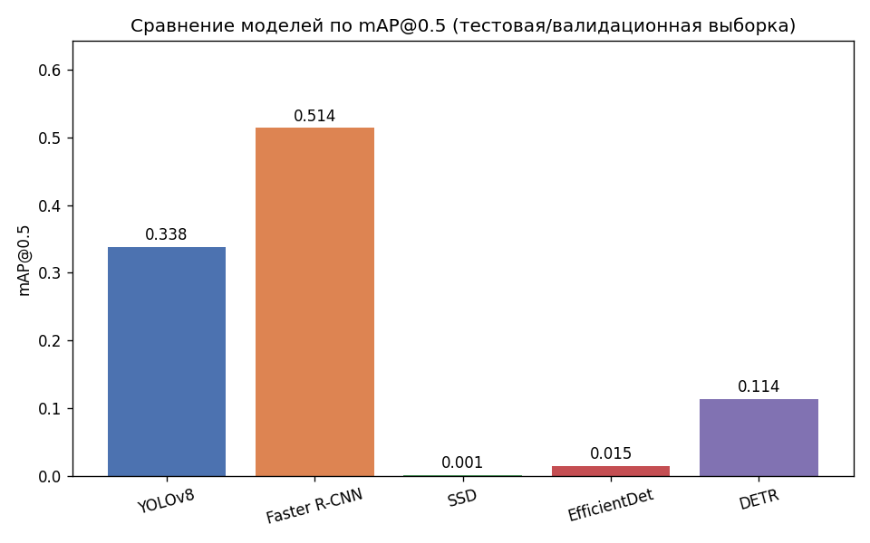
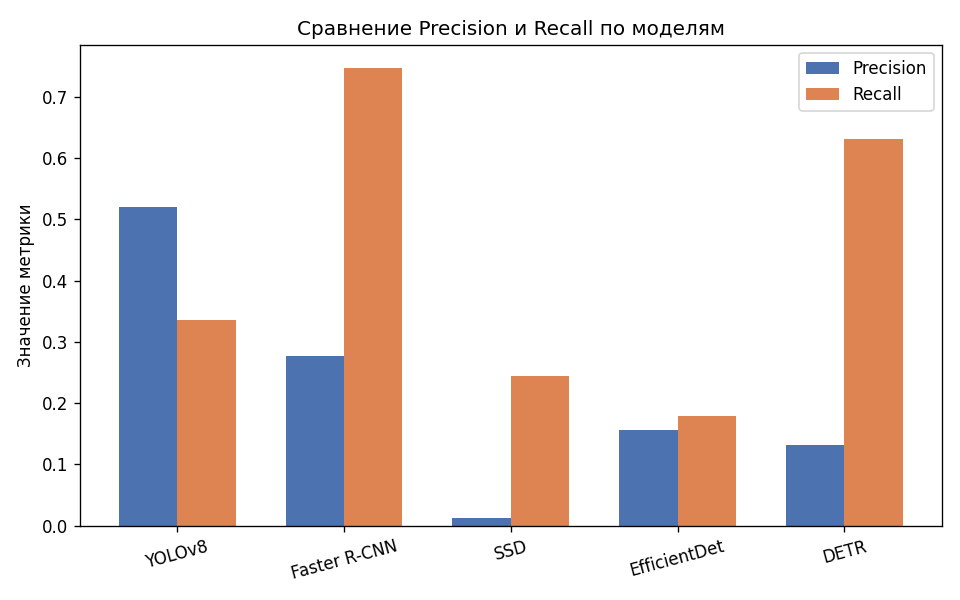
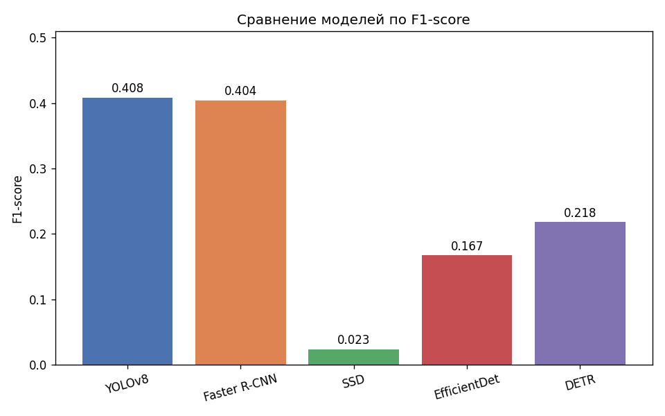
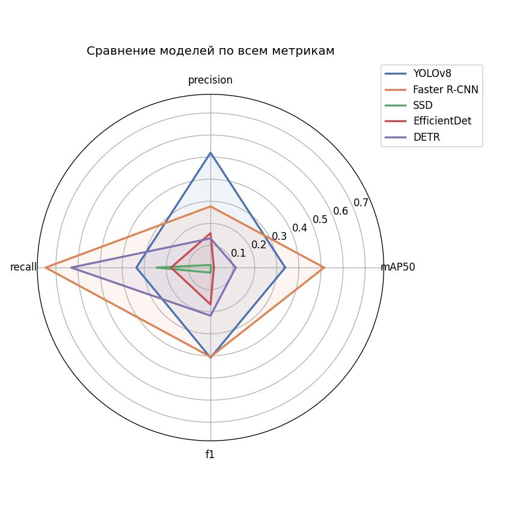
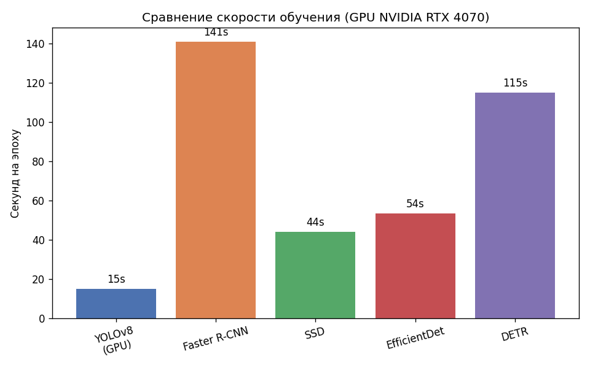

# 3.7 Результаты

## 3.7.1 Итоговая сравнительная таблица

Все модели оценены на отложенной тестовой/валидационной выборке
(раздел 3.4) при пороге IoU = 0.5, как определено в постановке задачи
(раздел 3.3).

| Модель | mAP@0.5 | Precision | Recall | F1-score |
|---|---|---|---|---|
| YOLOv8n | **0.338** | **0.520** | 0.336 | 0.405 |
| Faster R-CNN | **0.514** | 0.277 | **0.747** | 0.404 |
| SSD300 | 0.001 | 0.012 | 0.245 | 0.023 |
| EfficientDet-D0 | 0.015 | 0.156 | 0.179 | 0.167 |
| DETR | 0.114 | 0.132 | 0.631 | 0.218 |

*Жирным выделены лучшие значения по столбцу.*

## 3.7.2 Precision и Recall

Наблюдается чёткое разделение моделей на две группы по балансу
Precision/Recall:

- **YOLOv8** — единственная модель, где Precision выше Recall
  (0.520 vs 0.336): модель консервативна в предсказаниях, реже ошибается,
  но и реже находит все объекты.
- **Faster R-CNN и DETR** — выраженный перекос в сторону Recall (0.747 и
  0.631 соответственно при низком Precision): модели находят большинство
  реальных объектов, но генерируют существенное количество ложных
  срабатываний.
- **SSD и EfficientDet** — низкие значения обеих метрик одновременно,
  что указывает на общую слабую обученность моделей в рамках заданного
  бюджета эпох и вычислительных ресурсов.

## 3.7.3 F1-score

По интегральной метрике F1-score лидируют YOLOv8 (0.405) и Faster R-CNN
(0.404) — практически равный результат, достигнутый разными путями: первая
модель за счёт сбалансированных Precision/Recall, вторая — за счёт
компенсации низкого Precision высоким Recall.

## 3.7.4 Комплексное сравнение по всем метрикам

Радар-диаграмма наглядно показывает три различные "стратегии" моделей:
YOLOv8 образует наиболее равномерную фигуру (баланс по всем метрикам),
Faster R-CNN и DETR вытянуты в сторону Recall, а SSD образует наименьшую
по площади фигуру среди всех моделей — стабильно слабый результат по
всем метрикам одновременно.

## 3.7.5 Скорость обучения

| Модель | Среднее время на эпоху (GPU) |
|---|---|
| YOLOv8n | ~15 сек |
| SSD300 | ~44 сек |
| EfficientDet-D0 | ~53.5 сек |
| DETR | ~115 сек |
| Faster R-CNN | ~141 сек |

YOLOv8 продемонстрировал наибольшую скорость обучения среди всех пяти
моделей — почти в 10 раз быстрее на эпоху, чем Faster R-CNN, при этом
показав один из лучших результатов по точности. Это подтверждает выводы
литературного обзора (раздел 3.2) о преимуществе одностадийных
архитектур в задачах, где критична скорость работы.

## 3.7.6 Распределение датасета по классам (контекст для интерпретации)

Напомним результат анализа датасета (раздел 3.4): из 14545 размеченных
объектов 76% относится к классу "person" (11004 объекта), тогда как
класс "bus" представлен лишь 285 объектами (1.9%). Этот дисбаланс
напрямую влияет на интерпретацию результатов всех пяти моделей и
подробно разбирается в разделе 3.8 "Обсуждение".
